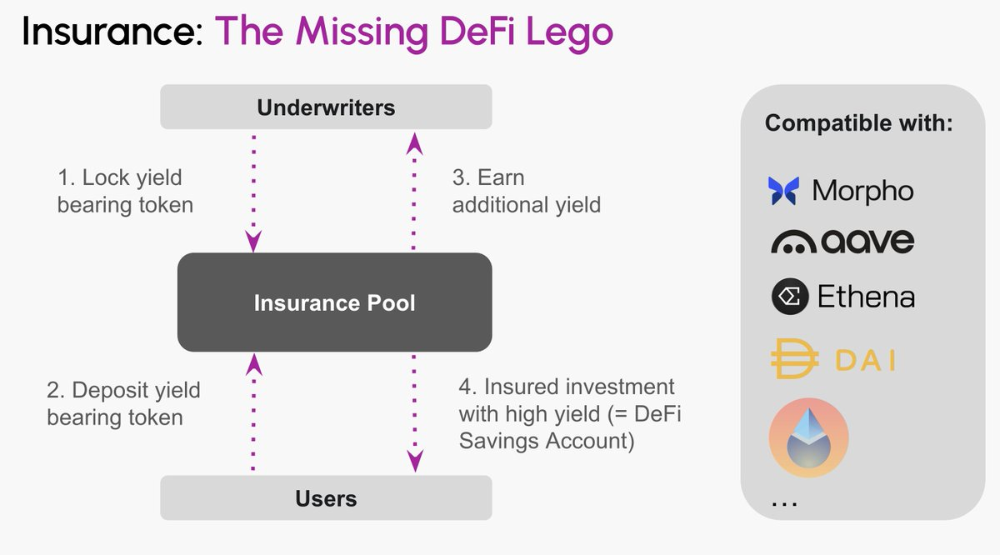
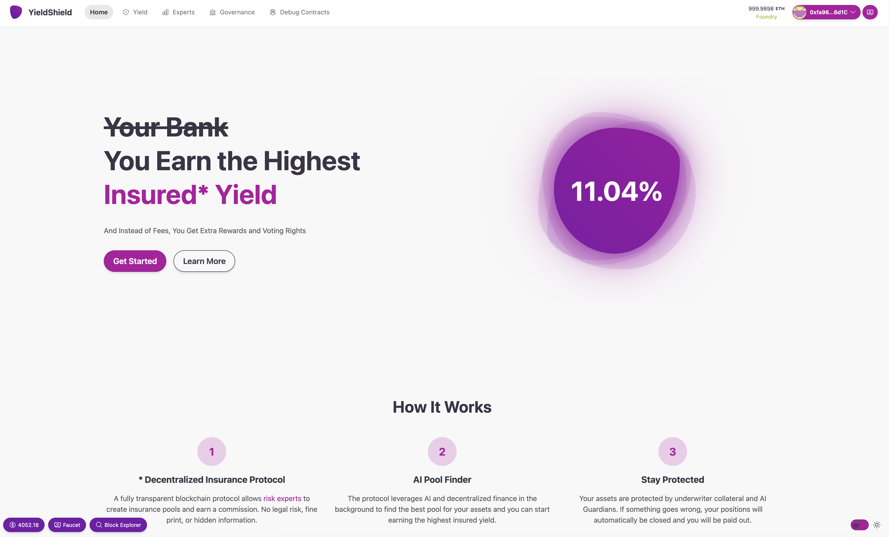
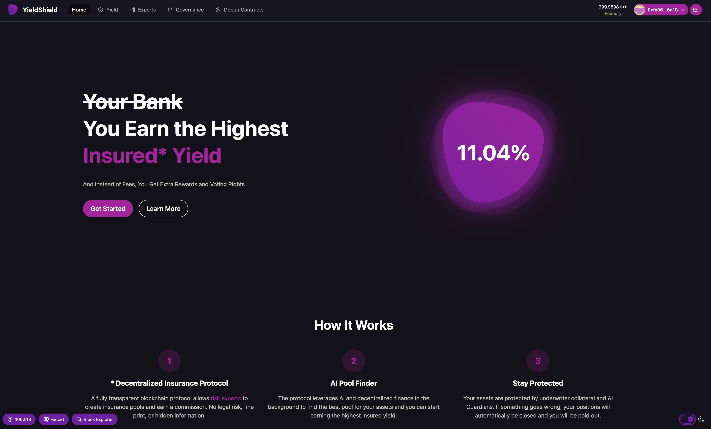
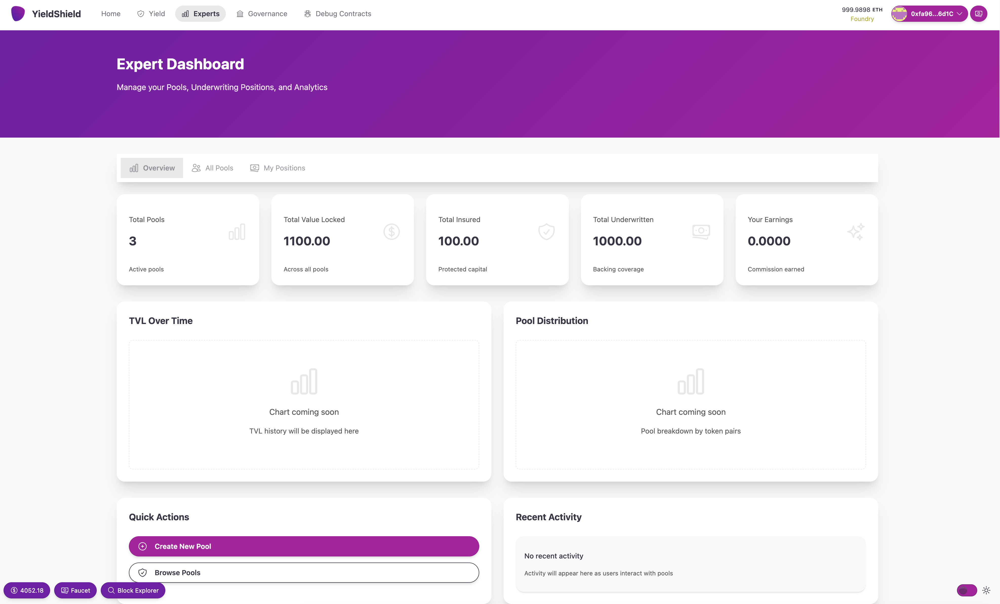
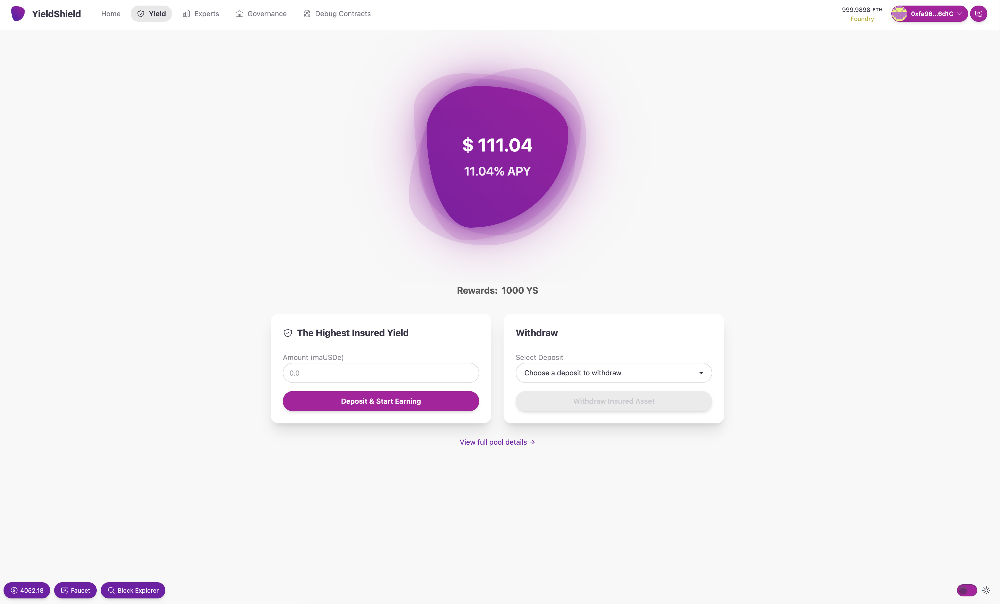

# YieldShield

## Project Overview

Your savings account is fully insured, you earn a small risk-free yield, and your bank gets rich. What if you could make high DeFi yields completely risk-free with a decentralized insurance protocol? 
That's exactly the problem that YieldShield solves. It's a decentralized, highly capital-efficient insurance protocol that uses a tranche-based risk allocation. It serves as the DeFi abstraction layer that makes decentralized finance usable for everyone and will disrupt traditional savings accounts.

The upcoming deployment of the REVM on the Polkadot Hub will help Polkadot to catch up when it comes to DeFi. However, Polkadot has very few advantages and incentives at this stage for external teams to bring liquidity to Polkadot. We hope to be able to deploy YieldShiel on the Hub and this way offer something unique and ultimately significantly increase the TVL of Polkadot.   

### Project Details

- Technology stack: Solidity, Ponder, Next.js 
- Documentation: https://www.yieldshield.dev/docs/overview 
- Mockups/designs of any UI components

- What your project is *not* or will *not* provide or implement:

YieldShield relies on yield-generating protocols like Morpho, Aave, etc. that can be integrated into YieldShield via recipe tokens. Theoretically, these tokens can also be bridged to Polkadot, but ideally, the protocols will be deployed on the hub itself. 

### Ecosystem Fit

- Where and how does your project fit into the ecosystem?

As pointed out above, YieldShield offers Polkadot a decentralized insurance protocol, which is something unique in the DeFi space and will attract additional users. So far, only https://flyingtulip.com/ plans to integrate a [decentralized insurance solution](https://docs.flyingtulip.com/product-suite/ft-insurance/). However, YieldShield has the advantage of not relying on centralized claim assessors or oracles for the claim process and is more capital-efficient.    

- Who is your target audience (parachain/dapp/wallet/UI developers, designers, your own user base, some dapp's userbase, yourself)?

Initially, we will target crypto users who are not DeFi degens. Essentially, users who know how to interact with a chain, but don't invest in DeFi vaults and strategies, because they don't understand the underlying risks. In the future, we want to cooperate with wallet providers, crypto neo banks, etc.   
  
- What need(s) does your project meet?

Reducing the risk that is associated with DeFi. 
  
- How did you identify these needs? Please provide evidence in the form of (scientific) articles, forum discussions, case studies, or raw data.

- e.g., https://www.accenture.com/content/dam/accenture/final/industry/banking/document/Accenture-Global-Banking-Consumer-Study-2025-Report.pdf. But we have done a lot of research regarding the topic and are happy to share some of our internal research documents. 

- Are there any other projects similar to yours in the Polkadot/Kusama ecosystem? 

[CoverMax](https://github.com/zalatar242/CoverMax-DeFi) also uses a tranch-based insurance protocol. However, as the original [research paper points out](https://arxiv.org/pdf/2212.10308), the design is too complex for regular users, given that they can buy insurance only for a fixed time, have to pay for it upfront, and constantly need to monitor the risk/collateralization.   

- Are there any projects similar to yours in related ecosystems?

[Nexus Mutual](https://nexusmutual.io/). 

## Team

> Please note that the data provided in this section is for administrative and informational purposes only. All beneficiaries of a grant must also be listed in the KYC/KYB process during the application phase.

- **Team Name:** YieldShield
- **Contact Name:** David Hawig
- **Contact Email:** info@yieldshield.ai
- **Website:** https://www.yieldshield.dev/

### Team members

#### LinkedIn Profiles (if available)

- https://www.linkedin.com/in/david-hawig-206a44b1/
- (happy to share the other members on a call or via email)

### Team Code Repos

- https://github.com/YieldShield (still private)

Please also provide the GitHub accounts of all team members. If they contain no activity, references to projects hosted elsewhere are also fine.

- https://github.com/Noc2

### Team's experience

Please describe the team's relevant experience, such as Polkadot-related projects in progress or contributions to the ecosystem made by team members in the past.

## Development Status

Academic publications relevant to the problem: 
- https://www.accenture.com/content/dam/accenture/final/industry/banking/document/Accenture-Global-Banking-Consumer-Study-2025-Report.pdf
- https://arxiv.org/pdf/2212.10308
- https://arxiv.org/pdf/2410.09341
  
Previous interface iterations, such as mock-ups and wireframes:
- see the above images

## Development Roadmap

This section should break the development roadmap down into milestones and deliverables. Since these will be part of the agreement, it helps to describe *the functionality we should expect in as much detail as possible*, plus how we can verify and test that functionality. Whenever milestones are delivered, we refer to this document to ensure that everything has been delivered as expected. Below, we provide an **example milestone** with mandatory (0a to 0e) and example deliverables. 

**Please notice that Polkadot Open Source Grants only accept projects up to 3 months of duration and up to 2 milestones.**

### Overview

- **Estimated Duration:** 3 Months
- **Full-Time Equivalent (FTE):**  2 FTE
- **Total Costs:** 18,000 USD

> Note that deliverables 0a to 0e are mandatory. Please adapt their specification to your project.

| Number | Deliverable | Specification |
| -----: | ----------- | ------------- |
| 0a. | License | Apache 2.0 / GPLv3 / MIT / Unlicense. See the [delivery guidelines](https://github.com/PolkadotOpenSourceGrants/delivery/blob/master/delivery-guidelines.md#license) for details. |
| 0b. | Documentation | We will provide both **inline documentation** of the code and a basic **tutorial** that explains how a user can... See the [delivery guidelines](https://github.com/PolkadotOpenSourceGrants/delivery/blob/master/delivery-guidelines.md#documentation) for details. |
| 0c. | Testing and Testing Guide | Core functions will be fully covered by comprehensive unit tests to ensure functionality and robustness. In the guide, we will describe how to run these tests. See the [delivery guidelines](https://github.com/PolkadotOpenSourceGrants/delivery/blob/master/delivery-guidelines.md#testing-guide) for details. |
| 0d. | Docker | We will provide a Dockerfile(s) that can be used to test all the functionality delivered with this milestone. |
| 0e. | Article | We will publish an **article**/workshop that explains [...] (what was done/achieved as part of the grant). (Content, language, and medium should reflect your target audience described above.) |
| 1. | Pallet X | We will create a Substrate module that will... (Please list the functionality that will be implemented for the first milestone. You can refer to details provided in previous sections.) |
| 2. | Smart contract Y | The Y Substrate module will... |
| 3. | Substrate chain | X and Y of our custom chain will interact in such a way... (Please describe the deliverable here as detailed as possible) |
| 4. | Library: ABC | We will deliver a JS library that will implement the functionality described under "ABC Library" |

### Budget Breakdown (Example, please adapt)
 **Category:** Budget Breakdown positions are split within the following categories: 
 
- Personnel
- Equipment

| Category | Item | Cost | Amount | Total | Description |
| --- | ---- | --- | --- | --- | ---|
| Personell | Full-Stack Developer | 8,000 USD | 0.5 FTE | 4,000 USD | leading project with tech architecture and design |
| Personell | Smart Contract Developer | 10,000 USD | 1 FTE | 10,000 USD | focused on execution and implementation |
| --- | --- | --- | **Total** | **14,000 USD** |  |

## Future Plans

Please include here

- how you intend to finance the project's long-term maintenance and development,
- how you intend to use, enhance, and promote your project in the short term, and
- the team's long-term plans and intentions in relation to it.

## Additional Information

Here you can also add any additional information that you think is relevant to this application but isn't part of it already, such as:

- Work you have already done
- If there are any other teams who have already contributed (financially) to the project
- Please declare if you have submitted this product for funding to any other entities, wether you got funded, how much you got funded, and provide any other relevant details.
